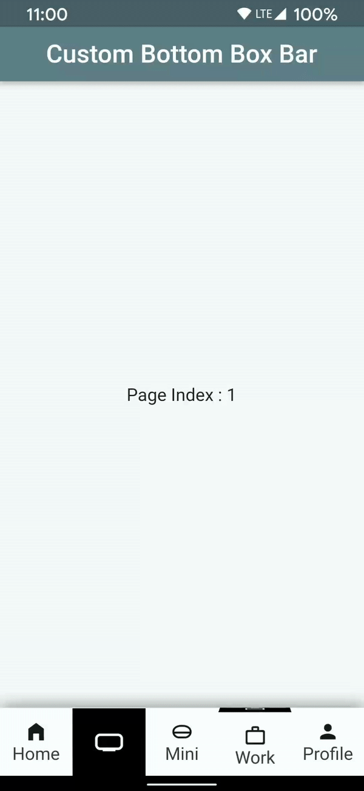

A custom bottom navigation bar with box animation. This is inspired from some of the earlier designs, but in a more simplified and yet exiting way.

## Demo

<!--  -->


<!--  -->

## Usage

To use the package, first, add the `custom_bottom_navigation` as the dependency in your `pubspec.yaml` file.

Then, add the `CustomBottomBoxBar()` in the `bottomNavigationBar:` field of `Scaffold()`. You need to provide two fields, `items:`(List of CustomBottomBaxBarItem) and `onIndexChange:` method. See the example below.

```dart
    Scaffold(
      bottomNavigationBar: CustomBottomBoxBar(
        inicialIndex: selectedPageIndex,
        onIndexChange: (int index) {
          setState(() {
            selectedPageIndex = index;
          });
        },
        items: [
          CustomBottomBoxBarItem(
              Icons.home_filled,
              Text('Home')),
          CustomBottomBoxBarItem(
              Icons.person,
              Text('Profile')),
        ],
      ),
    );
```

## Properties
You can custemize most of the properties like:

### Navigation bar Height
you can provide the height of navigation bar by `height` parameter.

### selected Item Box Color
you can provide the Color of selected item box by `selectedItemBoxColor` parameter.

### unselected Item Box Color
you can provide the Color of unselected item box by `unselectedItemBoxColor` parameter.

### selected Item Color
you can provide the Color of selected item by `selectedItemColor` parameter.

### unselected Item Color
you can provide the Color of selected item by `unselectedItemColor` parameter.

### Animation Duration
you can provide the animation duration by `duration` parameter.

### Inicial Index
you can provide the incial index by `inicialIndex` parameter.
